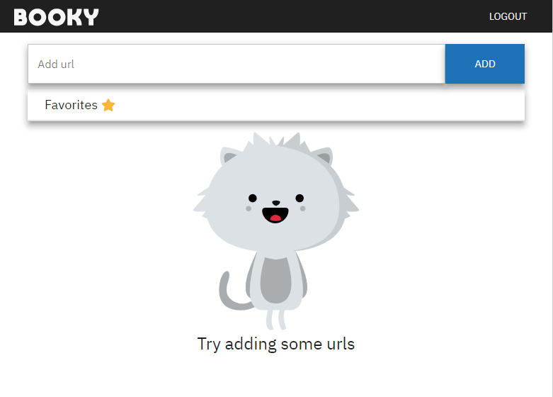
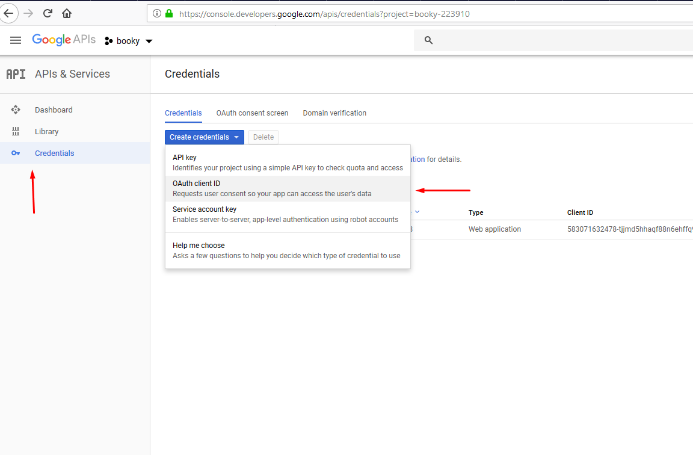

# Booky

Booky is a web app where you can store your bookmarks which are automatically grouped by the domain name. The app consists of 2 parts, the api which is built with NestJs and the client part which is built with React.

  

## How it works

## Getting Started

Docker is used through the entire project, so you'll have to install it for a pleasant dev experience, though it's possible to run everything locally without using docker making some small changes.

1. Create and fill an `.env` file in `client`, `server` and `db` folders, using as an example the `.env.example` file situated in each folder. 

2. Build the containers with `$ docker-compose build`.

3. Start the containers with `$ docker-compose up`. To get separated output from each container start them in different terminals with for ex. `$ docker-compose up server`.

The google credentials can be obtained by creating an app at https://console.developers.google.com and creating OAuth client Id credentials at Credentials tab with the Web application option selected.

## Deployment

The deployment is almost the same except that we need to use the `docker-compose.prod.yml` instead of `docker-compose.override.yml`

1. Edit the nginx config to suit your needs and point to your domains

2. Build the containers with `docker-compose -f docker-compose.yml -f docker-compose.prod.yml build`

3. Start the containers with `docker-compose -f docker-compose.yml -f docker-compose.prod.yml up -d`

## Built With
 * [React](https://reactjs.org/) - A JavaScript library for building user interfaces
 * [Redux](https://redux.js.org/) - A predictable state container for JavaScript apps.
 * [styled-components](https://www.styled-components.com/) - Visual primitives for the component age
 * [NestJs](https://nestjs.com/) - A progressive Node.js framework for building efficient, reliable and scalable server-side applications.
 * [TypeORM](http://typeorm.io/#/) - An ORM built with Typescript
 * [linuxserver/letsencrypt](https://github.com/linuxserver/docker-letsencrypt) - Nginx webserver and reverse proxy with php support and a built-in letsencrypt client

 ## Server Api Documentation 
  You can view the api documentation [here](https://documenter.getpostman.com/view/3950309/RzfZNXfU#cf370948-f9d2-4e41-86f1-ab5012ae6a16)