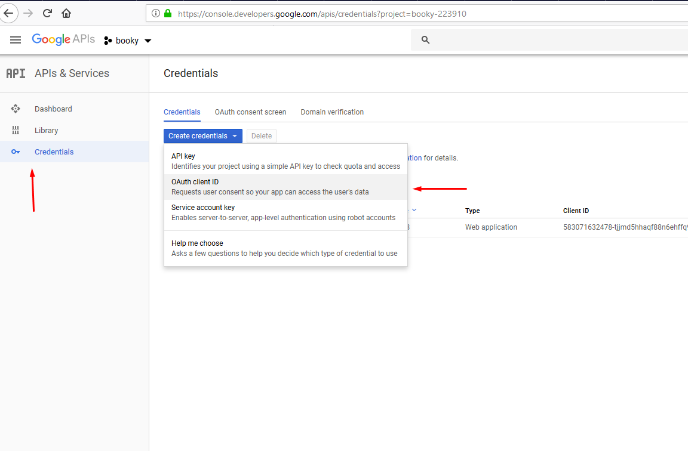

## Description

The server part. Build with [NestJS](https://nestjs.com/) and [TypeORM](http://typeorm.io/#/).

## Prerequisites

Running Mysql instance with a created table named `booky`

## Installation
1.
```bash
$ npm install
```
2.

Create a file named `constants.ts` in `src/` and copy the content from `constants.example.ts`.

The google credentials can be obtained by creating an app at [https://console.developers.google.com](https://console.developers.google.com) and creating OAuth client Id credentials at `Credentials` tab with the `Web application` option selected.




## Running the app

```bash
# development
$ npm run start

# watch mode
$ npm run start:dev

# incremental rebuild (webpack)
$ npm run webpack
$ npm run start:hmr

# production mode
$ npm run start:prod
```
## API Documentation

https://documenter.getpostman.com/view/3950309/RzfZNXfU#cf370948-f9d2-4e41-86f1-ab5012ae6a16   